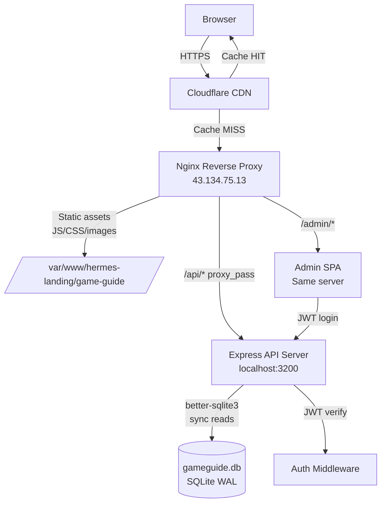
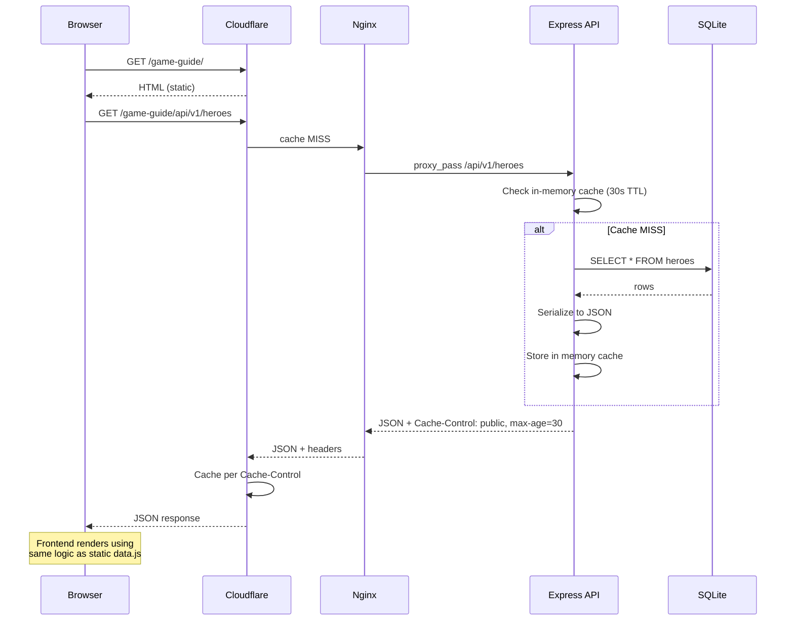
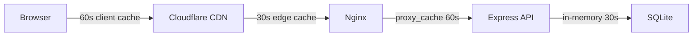

# Etheria Restart GameGuide — Architecture

## 1. System Overview



**Request flow:**

1. Browser requests `https://hermes.nousresearch.com/game-guide/`
2. Cloudflare checks cache — serves static HTML/CSS/images directly on HIT
3. On MISS, Nginx serves static files from `/var/www/hermes-landing/game-guide/`
4. Frontend JS calls `/api/heroes`, `/api/shells`, etc.
5. Nginx proxies `/api/*` to Express on `localhost:3200`
6. Express reads from SQLite (synchronous via better-sqlite3), returns JSON
7. Cloudflare caches API responses per `Cache-Control` headers

---

## 2. Directory Structure

```
/var/www/hermes-landing/
├── game-guide/                    # Existing static SPA (unchanged during Phase 1)
│   ├── index.html
│   ├── js/
│   │   ├── data.js                # heroes (static fallback)
│   │   ├── shells.js              # shells (static fallback)
│   │   ├── matrix_effects.js      # matrix (static fallback)
│   │   ├── tier_data_patch.js     # tiers (static fallback)
│   │   ├── role_data_patch.js     # roles (static fallback)
│   │   ├── team-builder.js        # team builder logic
│   │   ├── api-client.js          # NEW: fetch wrapper with fallback
│   │   └── ...
│   ├── css/
│   └── assets/
│
└── game-guide-api/                # NEW: API server
    ├── package.json
    ├── ecosystem.config.js        # PM2 config
    ├── src/
    │   ├── server.js              # Express app entry
    │   ├── db/
    │   │   ├── connection.js      # better-sqlite3 singleton
    │   │   ├── schema.sql         # DDL
    │   │   └── seed.js            # Import from static JS files
    │   ├── routes/
    │   │   ├── heroes.js
    │   │   ├── shells.js
    │   │   ├── matrix.js
    │   │   ├── tiers.js
    │   │   ├── roles.js
    │   │   ├── teams.js
    │   │   └── admin.js
    │   ├── middleware/
    │   │   ├── auth.js            # JWT verification
    │   │   ├── rateLimit.js
    │   │   ├── validate.js        # Zod schema validation
    │   │   └── cache.js           # In-memory response cache
    │   └── utils/
    │       └── errors.js
    ├── admin/                     # Admin SPA (Phase 2)
    │   └── index.html
    └── data/
        └── gameguide.db           # SQLite database file
```

---

## 3. API Design

### Base URL

```
https://hermes.nousresearch.com/game-guide/api/v1
```

### Endpoints

| Method | Endpoint | Description | Auth |
|--------|----------|-------------|------|
| `GET` | `/api/v1/heroes` | List all heroes (paginated) | No |
| `GET` | `/api/v1/heroes/:id` | Single hero by ID | No |
| `GET` | `/api/v1/heroes?role=healer&tier=S` | Filter heroes | No |
| `GET` | `/api/v1/shells` | List all shells | No |
| `GET` | `/api/v1/shells/:id` | Single shell | No |
| `GET` | `/api/v1/matrix` | List all matrix sets | No |
| `GET` | `/api/v1/matrix/:id` | Single matrix set | No |
| `GET` | `/api/v1/tiers/:tier` | Heroes in a tier (SS/S/A/B/C) | No |
| `GET` | `/api/v1/tiers` | Full tier list | No |
| `GET` | `/api/v1/roles` | All roles with hero counts | No |
| `GET` | `/api/v1/roles/:role` | Heroes by role | No |
| `POST` | `/api/v1/teams/validate` | Validate a team comp | No |
| `GET` | `/api/v1/search?q=...` | Full-text search | No |
| | **Admin endpoints** | | |
| `POST` | `/api/v1/auth/login` | Admin login → JWT | No |
| `PUT` | `/api/v1/admin/heroes/:id` | Update hero | JWT |
| `POST` | `/api/v1/admin/heroes` | Create hero | JWT |
| `DELETE` | `/api/v1/admin/heroes/:id` | Delete hero | JWT |
| `PUT` | `/api/v1/admin/shells/:id` | Update shell | JWT |
| `PUT` | `/api/v1/admin/tiers/:heroId` | Update tier assignment | JWT |
| `POST` | `/api/v1/admin/import` | Bulk import from JSON | JWT |
| `GET` | `/api/v1/admin/export` | Export full DB as JSON | JWT |

### Response Format

```json
{
  "success": true,
  "data": { ... },
  "meta": {
    "page": 1,
    "limit": 50,
    "total": 93
  }
}
```

### Error Response

```json
{
  "success": false,
  "error": {
    "code": "NOT_FOUND",
    "message": "Hero with id 'xyz' not found"
  }
}
```

### Query Parameters

```
GET /api/v1/heroes?role=healer&tier=S&sort=name&order=asc&page=1&limit=20&fields=id,name,role,tier
```

| Param | Description |
|-------|-------------|
| `role` | Filter by role (healer, tank, dps, support) |
| `tier` | Filter by tier (SS, S, A, B, C) |
| `element` | Filter by element |
| `sort` | Sort field (name, tier, role) |
| `order` | asc / desc |
| `page` | Pagination page (default: 1) |
| `limit` | Results per page (default: all) |
| `fields` | Sparse fieldset (comma-separated) |
| `q` | Search query (on /search endpoint) |

---

## 4. Database Schema

```sql
-- game-guide-api/src/db/schema.sql

PRAGMA journal_mode = WAL;
PRAGMA foreign_keys = ON;

CREATE TABLE IF NOT EXISTS heroes (
    id          TEXT PRIMARY KEY,          -- slug, e.g. "alice"
    name        TEXT NOT NULL,
    role        TEXT NOT NULL,             -- healer, tank, dps, support
    element     TEXT,
    rarity      TEXT,                      -- SSR, SR, R
    tier        TEXT DEFAULT 'B',          -- SS, S, A, B, C
    tier_note   TEXT,                      -- rationale for tier placement
    icon        TEXT,                      -- path to icon asset
    image       TEXT,                      -- path to full image
    skills      TEXT,                      -- JSON array
    stats       TEXT,                      -- JSON object
    tags        TEXT,                      -- JSON array of tags
    description TEXT,
    created_at  TEXT DEFAULT (datetime('now')),
    updated_at  TEXT DEFAULT (datetime('now'))
);

CREATE TABLE IF NOT EXISTS shells (
    id          TEXT PRIMARY KEY,
    name        TEXT NOT NULL,
    hero_id     TEXT REFERENCES heroes(id),
    tier        TEXT,
    effects     TEXT,                      -- JSON object
    description TEXT,
    icon        TEXT,
    created_at  TEXT DEFAULT (datetime('now')),
    updated_at  TEXT DEFAULT (datetime('now'))
);

CREATE TABLE IF NOT EXISTS matrix_sets (
    id          TEXT PRIMARY KEY,
    name        TEXT NOT NULL,
    pieces      INTEGER,                   -- 2-piece, 4-piece, etc.
    effects     TEXT,                      -- JSON object
    description TEXT,
    icon        TEXT,
    created_at  TEXT DEFAULT (datetime('now')),
    updated_at  TEXT DEFAULT (datetime('now'))
);

CREATE TABLE IF NOT EXISTS tier_assignments (
    id          INTEGER PRIMARY KEY AUTOINCREMENT,
    hero_id     TEXT NOT NULL REFERENCES heroes(id),
    tier        TEXT NOT NULL,             -- SS, S, A, B, C
    mode        TEXT DEFAULT 'pve',       -- pve, pvp, general
    note        TEXT,
    updated_at  TEXT DEFAULT (datetime('now')),
    UNIQUE(hero_id, mode)
);

CREATE TABLE IF NOT EXISTS roles (
    id          TEXT PRIMARY KEY,          -- healer, tank, dps, support
    name        TEXT NOT NULL,
    description TEXT,
    icon        TEXT
);

CREATE TABLE IF NOT EXISTS hero_roles (
    hero_id     TEXT NOT NULL REFERENCES heroes(id),
    role_id     TEXT NOT NULL REFERENCES roles(id),
    is_primary  INTEGER DEFAULT 1,
    PRIMARY KEY (hero_id, role_id)
);

CREATE TABLE IF NOT EXISTS admin_users (
    id          INTEGER PRIMARY KEY AUTOINCREMENT,
    username    TEXT UNIQUE NOT NULL,
    password    TEXT NOT NULL,             -- bcrypt hash
    created_at  TEXT DEFAULT (datetime('now'))
);

-- Full-text search index on heroes
CREATE VIRTUAL TABLE IF NOT EXISTS heroes_fts USING fts5(
    name, role, element, tags, description,
    content=heroes,
    content_rowid=rowid
);

-- Triggers to keep FTS in sync
CREATE TRIGGER IF NOT EXISTS heroes_ai AFTER INSERT ON heroes BEGIN
    INSERT INTO heroes_fts(rowid, name, role, element, tags, description)
    VALUES (new.rowid, new.name, new.role, new.element, new.tags, new.description);
END;

CREATE TRIGGER IF NOT EXISTS heroes_ad AFTER DELETE ON heroes BEGIN
    INSERT INTO heroes_fts(heroes_fts, rowid, name, role, element, tags, description)
    VALUES ('delete', old.rowid, old.name, old.role, old.element, old.tags, old.description);
END;

CREATE TRIGGER IF NOT EXISTS heroes_au AFTER UPDATE ON heroes BEGIN
    INSERT INTO heroes_fts(heroes_fts, rowid, name, role, element, tags, description)
    VALUES ('delete', old.rowid, old.name, old.role, old.element, old.tags, old.description);
    INSERT INTO heroes_fts(rowid, name, role, element, tags, description)
    VALUES (new.rowid, new.name, new.role, new.element, new.tags, new.description);
END;

-- Indexes
CREATE INDEX IF NOT EXISTS idx_heroes_role ON heroes(role);
CREATE INDEX IF NOT EXISTS idx_heroes_tier ON heroes(tier);
CREATE INDEX IF NOT EXISTS idx_heroes_element ON heroes(element);
CREATE INDEX IF NOT EXISTS idx_shells_hero ON shells(hero_id);
CREATE INDEX IF NOT EXISTS idx_tier_assignments_hero ON tier_assignments(hero_id);
CREATE INDEX IF NOT EXISTS idx_tier_assignments_tier ON tier_assignments(tier);
```

---

## 5. Data Flow



### Frontend Integration Pattern

```javascript
// game-guide/js/api-client.js — NEW file

const API_BASE = '/game-guide/api/v1';
const CACHE_TTL = 60_000; // 60s client-side cache

const clientCache = new Map();

async function fetchAPI(endpoint) {
    const cacheKey = endpoint;
    const cached = clientCache.get(cacheKey);
    if (cached && Date.now() - cached.ts < CACHE_TTL) {
        return cached.data;
    }

    try {
        const res = await fetch(`${API_BASE}${endpoint}`, {
            headers: { 'Accept': 'application/json' }
        });
        if (!res.ok) throw new Error(`API ${res.status}`);
        const json = await res.json();
        clientCache.set(cacheKey, { data: json.data, ts: Date.now() });
        return json.data;
    } catch (err) {
        console.warn(`API fetch failed for ${endpoint}, using static fallback`, err);
        return null; // caller falls back to window.GAME_DATA
    }
}

// Drop-in replacements for existing data access
async function getHeroes() {
    const apiData = await fetchAPI('/heroes');
    return apiData || window.GAME_DATA.heroes; // fallback to data.js
}

async function getShells() {
    const apiData = await fetchAPI('/shells');
    return apiData || window.GAME_DATA.shells;
}

async function searchHeroes(query) {
    const apiData = await fetchAPI(`/search?q=${encodeURIComponent(query)}`);
    return apiData || [];
}
```

**Migration is transparent:** existing code reads `window.GAME_DATA.heroes`. The new `getHeroes()` returns API data or falls back to the same object. No UI rewrite needed.

---

## 6. Migration Strategy

### Phase 1 — API + Database (no frontend changes)

| Step | Action | Verification |
|------|--------|-------------|
| 1 | Create `game-guide-api/` directory | `ls` |
| 2 | `npm init` + install deps | `npm install` |
| 3 | Write schema.sql, run migration | `sqlite3 data/gameguide.db < src/db/schema.sql` |
| 4 | Write seed.js to parse data.js/shells.js/matrix_effects.js | `node src/db/seed.js` → verify row counts |
| 5 | Build API routes | `curl localhost:3200/api/v1/heroes` |
| 6 | Add nginx proxy for `/game-guide/api/` | `curl` through nginx |
| 7 | Deploy with PM2 | `pm2 status` |

**Both static and API are live.** Frontend still uses static JS files. API is available for testing.

### Phase 2 — Admin Panel

| Step | Action |
|------|--------|
| 1 | Build admin login page (JWT flow) |
| 2 | Build CRUD forms for heroes/shells/matrix |
| 3 | Build tier list editor (drag-drop or dropdown) |
| 4 | Build bulk import/export |
| 5 | Deploy admin at `/game-guide/admin/` |

### Phase 3 — Frontend Switch

| Step | Action | Rollback |
|------|--------|----------|
| 1 | Add `api-client.js` to all pages | Remove script tag |
| 2 | Change hero list to call `getHeroes()` | Revert to `window.GAME_DATA.heroes` |
| 3 | Change shell/matrix/tier views | Same |
| 4 | Monitor for errors via `window.onerror` logging | |
| 5 | Once stable, make static JS files optional | Keep them as fallback |

**Zero-downtime rollback:** if the API fails, the frontend silently falls back to static data.

---

## 7. Caching Strategy

### Layered Caching



| Layer | TTL | Invalidation |
|-------|-----|-------------|
| **Client** (Map in api-client.js) | 60s | Manual clear on admin update |
| **Cloudflare** (via Cache-Control) | 30s | Purge on admin write |
| **Nginx** (proxy_cache) | 60s | Bypass header from API |
| **Express** (in-memory Map) | 30s | Clear on admin write |

### Cache Headers

```javascript
// In Express route
router.get('/heroes', (req, res) => {
    const heroes = getCachedOrQuery('heroes', () => db.prepare('SELECT * FROM heroes').all());
    res.set('Cache-Control', 'public, max-age=30, stale-while-revalidate=60');
    res.set('ETag', generateETag(heroes));
    res.json({ success: true, data: heroes });
});
```

### Nginx Proxy Cache

```nginx
proxy_cache_path /tmp/gameguide-api levels=1:2
    keys_zone=gameguide:10m max_size=100m
    inactive=5m use_temp_path=off;

server {
    location /game-guide/api/ {
        proxy_pass http://127.0.0.1:3200;
        proxy_cache gameguide;
        proxy_cache_valid 200 60s;
        proxy_cache_use_stale error timeout updating;
        add_header X-Cache-Status $upstream_cache_status;
        proxy_set_header X-Real-IP $remote_addr;
    }
}
```

---

## 8. Error Handling & Fallback

```javascript
// middleware/errorHandler.js
function errorHandler(err, req, res, next) {
    console.error(`[${new Date().toISOString()}] ${req.method} ${req.path}:`, err.message);

    if (err.name === 'ValidationError') {
        return res.status(400).json({
            success: false,
            error: { code: 'VALIDATION_ERROR', message: err.message, details: err.details }
        });
    }
    if (err.name === 'UnauthorizedError') {
        return res.status(401).json({
            success: false,
            error: { code: 'UNAUTHORIZED', message: 'Invalid or expired token' }
        });
    }

    res.status(500).json({
        success: false,
        error: { code: 'INTERNAL_ERROR', message: 'Something went wrong' }
    });
}
```

**Frontend fallback:** Every `fetchAPI()` call returns `null` on error; the calling code falls back to the static `window.GAME_DATA` object. The user sees no disruption.

**Database fallback:** If SQLite is corrupted or missing, the API returns a 503, and Nginx can be configured to serve the static HTML instead.

---

## 9. Security

### Rate Limiting

```javascript
const rateLimit = require('express-rate-limit');

const apiLimiter = rateLimit({
    windowMs: 60_000,     // 1 minute
    max: 120,              // 120 requests per minute per IP
    standardHeaders: true,
    legacyHeaders: false,
    message: { success: false, error: { code: 'RATE_LIMIT', message: 'Too many requests' } }
});

app.use('/api/', apiLimiter);
```

### Input Validation (Zod)

```javascript
const { z } = require('zod');

const heroSchema = z.object({
    id:    z.string().min(1).max(50).regex(/^[a-z0-9-]+$/),
    name:  z.string().min(1).max(100),
    role:  z.enum(['healer', 'tank', 'dps', 'support']),
    tier:  z.enum(['SS', 'S', 'A', 'B', 'C']).optional(),
    // ... other fields
});

function validate(schema) {
    return (req, res, next) => {
        const result = schema.safeParse(req.body);
        if (!result.success) {
            return res.status(400).json({
                success: false,
                error: { code: 'VALIDATION_ERROR', message: result.error.issues }
            });
        }
        req.validated = result.data;
        next();
    };
}
```

### CORS

```javascript
const cors = require('cors');

app.use(cors({
    origin: [
        'https://hermes.nousresearch.com',
        'http://localhost:3000'  // dev only
    ],
    methods: ['GET', 'POST', 'PUT', 'DELETE'],
    allowedHeaders: ['Content-Type', 'Authorization']
}));
```

### JWT Auth (admin only)

```javascript
// middleware/auth.js
const jwt = require('jsonwebtoken');

function requireAuth(req, res, next) {
    const token = req.headers.authorization?.replace('Bearer ', '');
    if (!token) return res.status(401).json({ success: false, error: { code: 'NO_TOKEN' } });

    try {
        req.user = jwt.verify(token, process.env.JWT_SECRET);
        next();
    } catch {
        res.status(401).json({ success: false, error: { code: 'INVALID_TOKEN' } });
    }
}

// Login endpoint
app.post('/api/v1/auth/login', async (req, res) => {
    const { username, password } = req.body;
    const user = db.prepare('SELECT * FROM admin_users WHERE username = ?').get(username);
    if (!user || !await bcrypt.compare(password, user.password)) {
        return res.status(401).json({ success: false, error: { code: 'BAD_CREDENTIALS' } });
    }
    const token = jwt.sign({ id: user.id, username }, process.env.JWT_SECRET, { expiresIn: '24h' });
    res.json({ success: true, data: { token } });
});
```

### Helmet (HTTP security headers)

```javascript
const helmet = require('helmet');
app.use(helmet());
```

---

## 10. Performance

### SQLite Configuration

```javascript
// db/connection.js
const Database = require('better-sqlite3');
const path = require('path');

const db = new Database(path.join(__dirname, '..', 'data', 'gameguide.db'), {
    readonly: false,
    fileMustExist: false
});

// Performance pragmas
db.pragma('journal_mode = WAL');          // Write-Ahead Logging for concurrent reads
db.pragma('synchronous = NORMAL');        // Faster writes, still safe with WAL
db.pragma('cache_size = -64000');         // 64MB page cache
db.pragma('mmap_size = 268435456');       // 256MB memory-mapped I/O
db.pragma('temp_store = MEMORY');         // Temp tables in RAM
db.pragma('busy_timeout = 5000');         // Wait up to 5s on locks

module.exports = db;
```

### Prepared Statement Caching

```javascript
// All statements are prepared once at startup (better-sqlite3 caches them)
const statements = {
    getAllHeroes:   db.prepare('SELECT * FROM heroes ORDER BY name'),
    getHeroById:    db.prepare('SELECT * FROM heroes WHERE id = ?'),
    getHeroesByRole: db.prepare('SELECT * FROM heroes WHERE role = ?'),
    getHeroesByTier: db.prepare('SELECT * FROM heroes WHERE tier = ?'),
    searchHeroes:   db.prepare(`SELECT * FROM heroes_fts WHERE heroes_fts MATCH ? ORDER BY rank`),
    updateHero:     db.prepare(`UPDATE heroes SET name=@name, role=@role, tier=@tier, updated_at=datetime('now') WHERE id=@id`),
    insertHero:     db.prepare(`INSERT INTO heroes (id, name, role, tier) VALUES (@id, @name, @role, @tier)`)
};
```

### In-Memory Response Cache

```javascript
const memCache = new Map();

function getCachedOrQuery(key, queryFn, ttl = 30_000) {
    const entry = memCache.get(key);
    if (entry && Date.now() - entry.ts < ttl) return entry.data;

    const data = queryFn();
    memCache.set(key, { data, ts: Date.now() });
    return data;
}

// Clear cache on admin writes
function invalidateCache(...keys) {
    keys.forEach(k => memCache.delete(k));
}
```

### Expected Performance

| Metric | Expected |
|--------|----------|
| SQLite read (93 heroes) | < 1ms |
| API response (cold) | < 5ms |
| API response (cached) | < 0.5ms |
| End-to-end (browser, uncached) | < 50ms |
| End-to-end (browser, CDN cached) | < 5ms |
| Database file size (93 heroes + 43 shells + 27 matrix) | < 2MB |

---

## 11. Deployment

### PM2 Configuration

```javascript
// game-guide-api/ecosystem.config.js
module.exports = {
    apps: [{
        name: 'gameguide-api',
        script: 'src/server.js',
        cwd: '/var/www/hermes-landing/game-guide-api',
        instances: 1,                    // SQLite = single writer anyway
        exec_mode: 'fork',
        env: {
            NODE_ENV: 'production',
            PORT: 3200,
            JWT_SECRET: 'change-me-in-production',
            DB_PATH: './data/gameguide.db'
        },
        max_memory_restart: '256M',
        log_date_format: 'YYYY-MM-DD HH:mm:ss',
        error_file: '/var/log/gameguide-api/error.log',
        out_file: '/var/log/gameguide-api/out.log',
        merge_logs: true
    }]
};
```

### Nginx Configuration

```nginx
# /etc/nginx/sites-available/hermes-landing
# Add this location block to the existing server block

server {
    listen 443 ssl http2;
    server_name hermes.nousresearch.com;

    # ... existing static file serving ...

    # Game Guide static SPA (existing)
    location /game-guide/ {
        alias /var/www/hermes-landing/game-guide/;
        try_files $uri $uri/ /game-guide/index.html;

        # Cache static assets aggressively
        location ~* \.(js|css|png|jpg|svg|woff2)$ {
            expires 7d;
            add_header Cache-Control "public, immutable";
        }
    }

    # Game Guide API (new)
    location /game-guide/api/ {
        proxy_pass http://127.0.0.1:3200/api/;
        proxy_http_version 1.1;
        proxy_set_header Host $host;
        proxy_set_header X-Real-IP $remote_addr;
        proxy_set_header X-Forwarded-For $proxy_add_x_forwarded_for;
        proxy_set_header X-Forwarded-Proto $scheme;

        # Proxy cache for GET requests
        proxy_cache gameguide;
        proxy_cache_valid 200 60s;
        proxy_cache_methods GET;
        proxy_cache_use_stale error timeout updating;
        add_header X-Cache-Status $upstream_cache_status always;

        # Don't cache admin or auth routes
        location /game-guide/api/v1/admin/ {
            proxy_pass http://127.0.0.1:3200/api/v1/admin/;
            proxy_cache off;
        }
        location /game-guide/api/v1/auth/ {
            proxy_pass http://127.0.0.1:3200/api/v1/auth/;
            proxy_cache off;
        }
    }

    # Game Guide Admin Panel (new, Phase 2)
    location /game-guide/admin/ {
        alias /var/www/hermes-landing/game-guide-api/admin/;
        try_files $uri $uri/ /game-guide/admin/index.html;
    }
}
```

### Deployment Script

```bash
#!/bin/bash
# deploy-api.sh

set -e

cd /var/www/hermes-landing/game-guide-api

# Install deps
npm ci --production

# Run migrations (idempotent)
node -e "require('./src/db/connection')"

# Seed if first deploy
if [ ! -f data/gameguide.db ]; then
    node src/db/seed.js
fi

# Restart via PM2
pm2 start ecosystem.config.js --update-env || pm2 restart gameguide-api --update-env

# Verify
sleep 2
curl -sf http://localhost:3200/api/v1/heroes | head -c 200
echo ""
echo "✓ API deployed successfully"
```

### Quick Start Commands

```bash
# 1. Create project
mkdir -p /var/www/hermes-landing/game-guide-api
cd /var/www/hermes-landing/game-guide-api
npm init -y
npm install express better-sqlite3 jsonwebtoken bcrypt zod cors helmet express-rate-limit

# 2. Create directory structure
mkdir -p src/{db,routes,middleware,utils} data admin

# 3. Write source files (see sections above)

# 4. Initialize DB
node src/db/seed.js

# 5. Test locally
node src/server.js
curl http://localhost:3200/api/v1/heroes

# 6. Deploy with PM2
pm2 start ecosystem.config.js
pm2 save

# 7. Reload nginx
sudo nginx -t && sudo systemctl reload nginx
```

---

## Appendix: Dependencies

```json
{
    "dependencies": {
        "express": "^4.18",
        "better-sqlite3": "^11.0",
        "jsonwebtoken": "^9.0",
        "bcrypt": "^5.1",
        "zod": "^3.22",
        "cors": "^2.8",
        "helmet": "^7.1",
        "express-rate-limit": "^7.1"
    },
    "devDependencies": {
        "nodemon": "^3.0"
    }
}
```

**Total installed size:** ~15MB (mostly bcrypt native bindings)
